# Harmony Platform Architecture

> A sovereign, decentralized real-time communication platform built on DIDs, Verifiable Credentials, ZCAP authorization, and end-to-end encryption.

---

## 1. System Overview

Harmony runs across five deployment targets sharing a common UI and protocol layer.

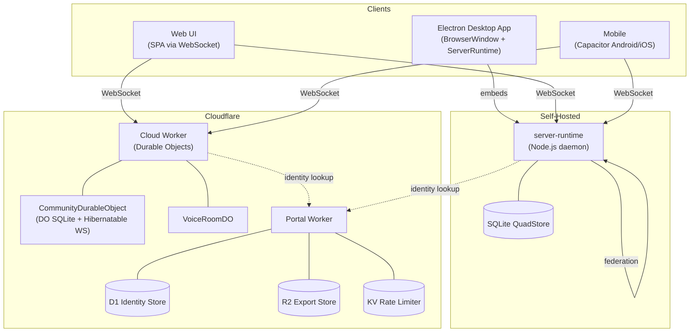

> Note: The Electron app embeds `ServerRuntime` in the main process — it functions as both client and server simultaneously. Web and Mobile clients connect to remote servers.

### Deployment Target Summary

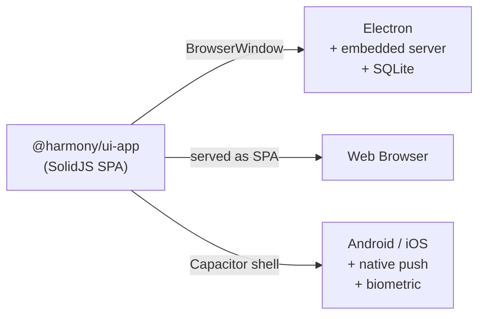

---

## 2. Package Dependency Graph

36 packages organised in five layers. Key dependency edges shown (not exhaustive).

### Core Layer

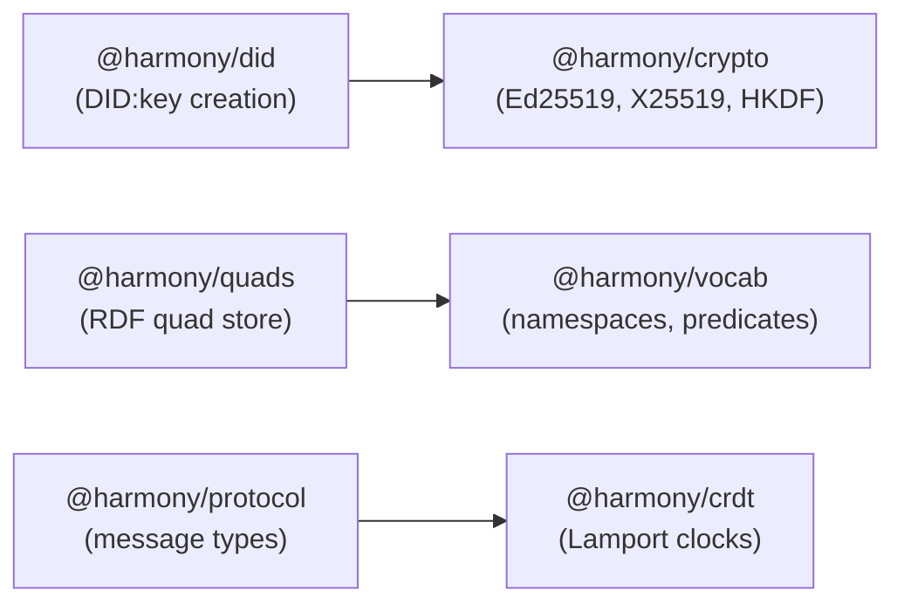

### Identity, Auth & Communication Layers

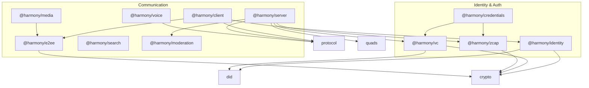

### Infrastructure & Application Layers

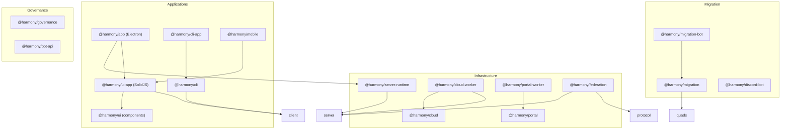

---

## 3. Identity & DID System

### DID Creation Flow

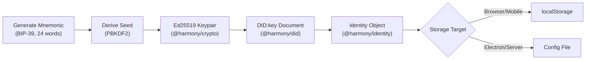

### DID Document Structure

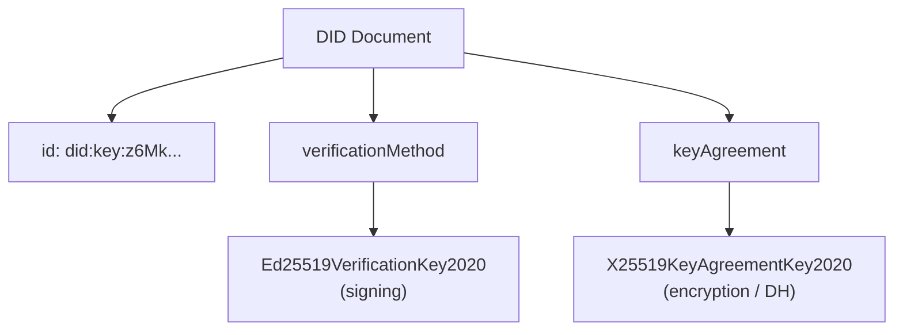

### Social Recovery Flow

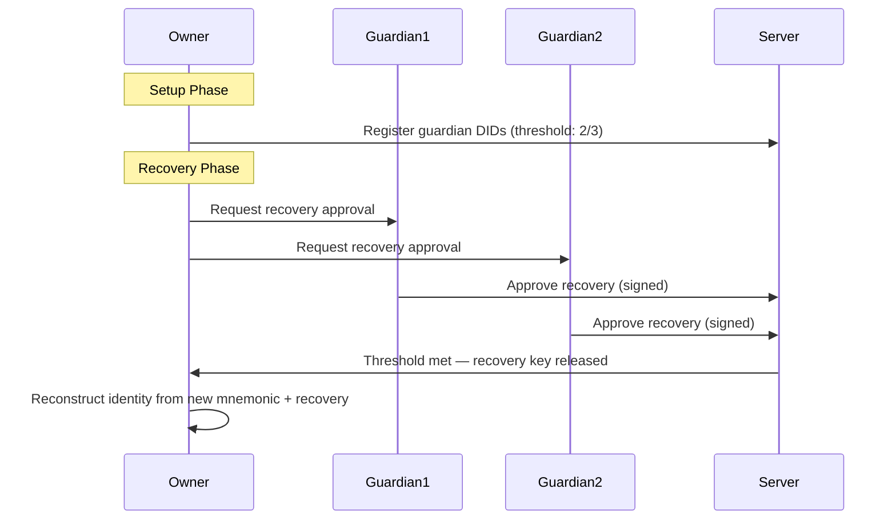

> Note: `@harmony/crypto` provides all primitives (Ed25519, X25519, HKDF). `@harmony/did` creates DID documents. `@harmony/identity` manages the full lifecycle including persistence and recovery.

---

## 4. Verifiable Credentials (VCs)

### VC Issuance & Verification

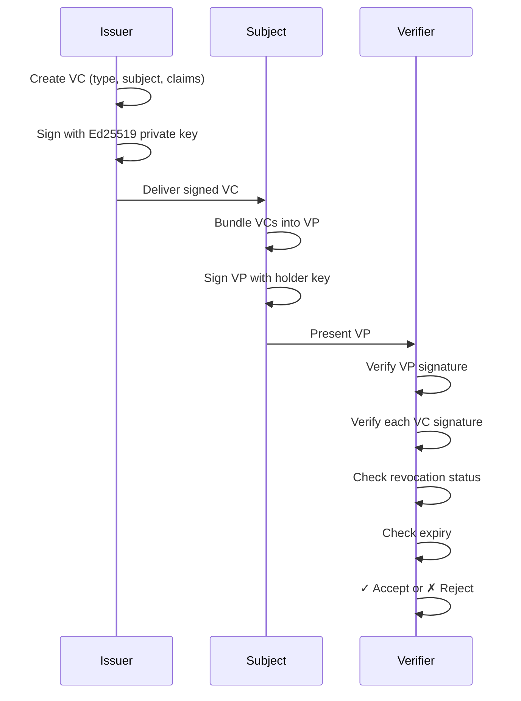

### VC Types & Policy

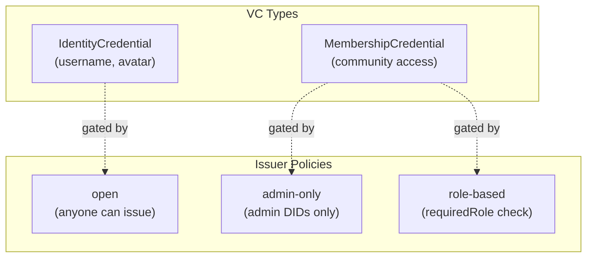

> Note: Revocation store is currently in-memory. Future work includes persistent revocation, VC-based community admission gates, cross-community trust chains, and E2EE key binding to VCs.

---

## 5. ZCAP (Authorization Capabilities)

### Capability Delegation Chain

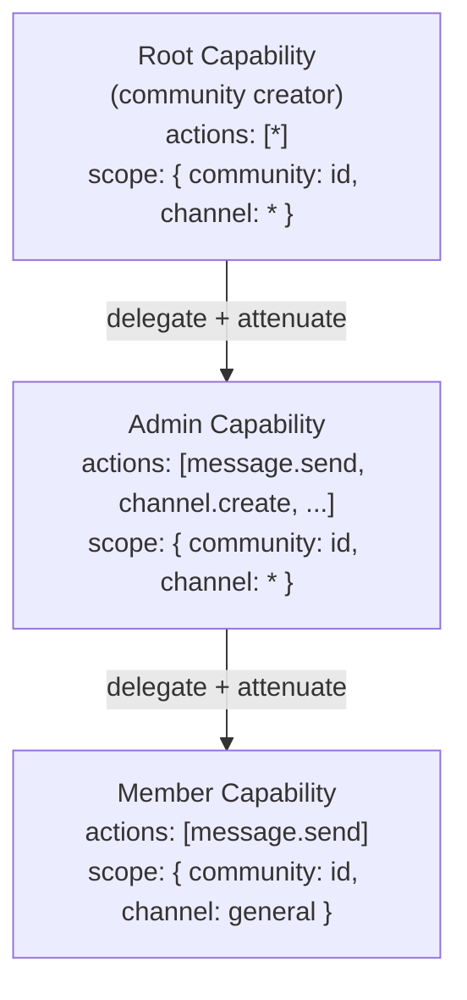

### Server ZCAP Verification

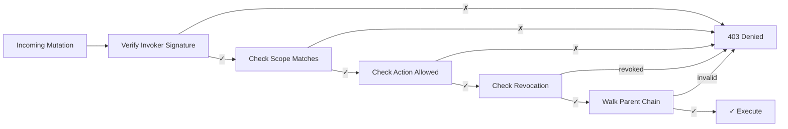

> Note: Every mutation passes through ZCAP verification. Caveats (time-limited, rate-limited) are designed but not yet enforced.

---

## 6. Authentication Flow (VP Handshake)

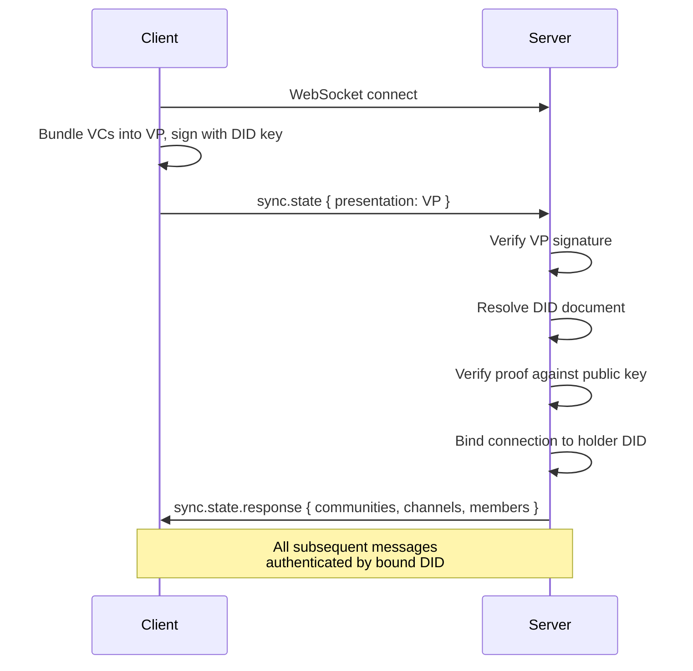

> Note: The VP handshake replaces traditional username/password login. The server never sees private keys — only signed proofs.

---

## 7. End-to-End Encryption

### 7a. MLS for Channel Messages

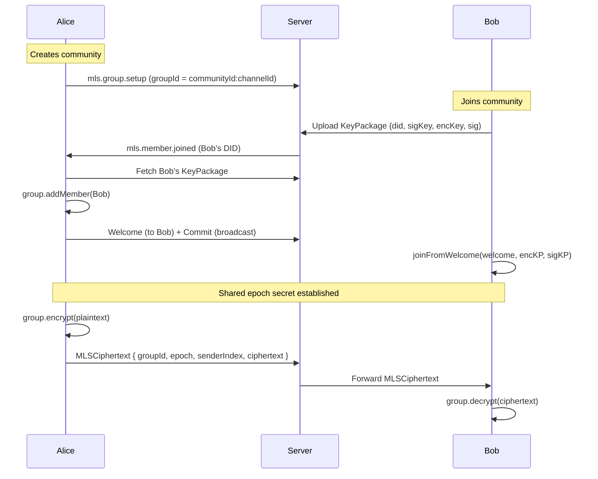

### MLS Epoch Model

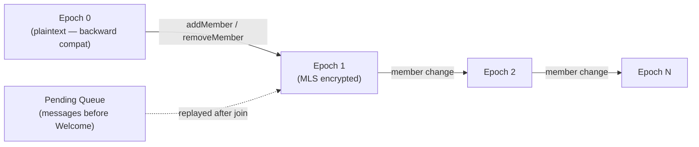

> Note: Epoch 0 means plaintext (for backward compatibility). Epoch > 0 = MLS encrypted. `processCommit` guards against stale epochs. Client dedup via `_pendingMemberDIDs` Map.

### 7b. DM Encryption (X25519 + XChaCha20-Poly1305)

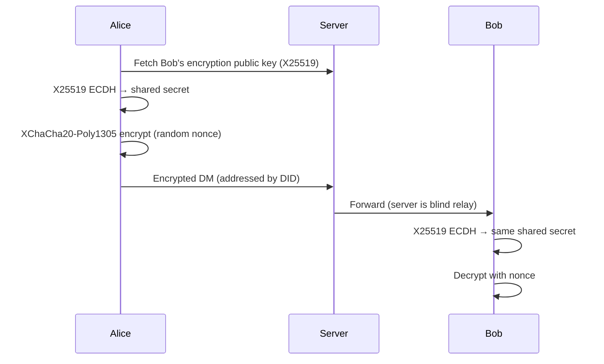

### 7c. Media Encryption

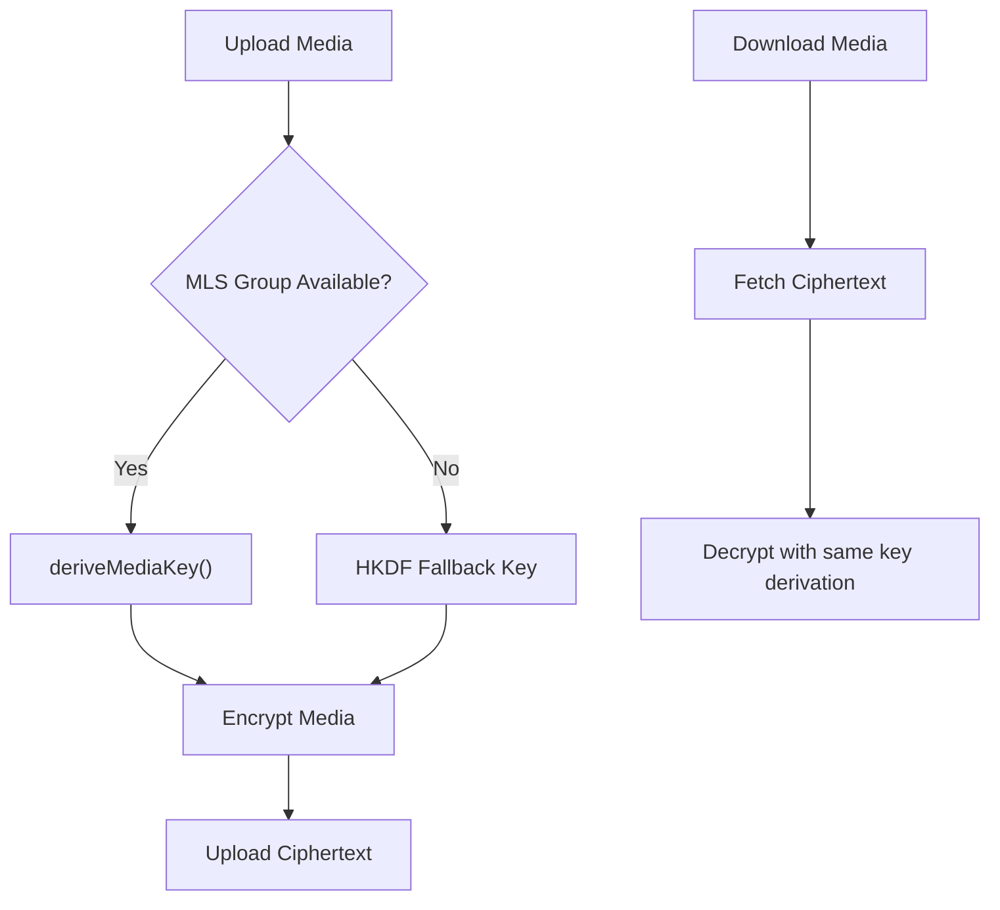

---

## 8. Message Flow & Protocol

### Channel Message Path

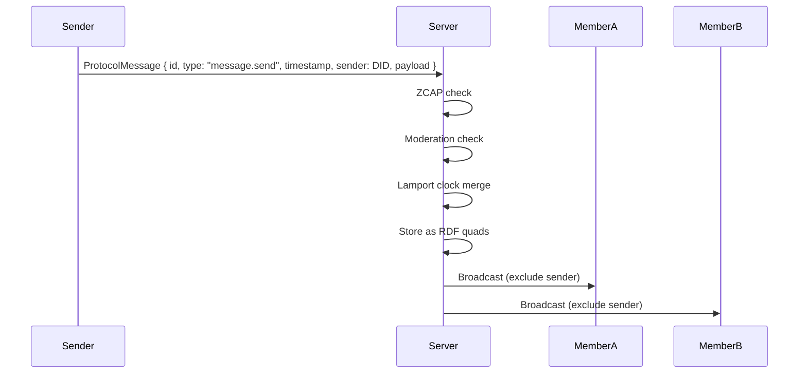

### ProtocolMessage Structure

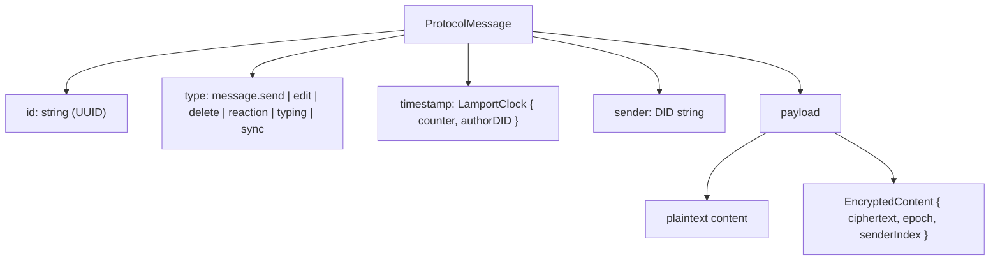

> Note: Lamport clocks provide causal ordering across distributed nodes. The CRDT layer ensures convergent state even with out-of-order delivery.

---

## 9. Community & Channel Architecture

### Community Lifecycle

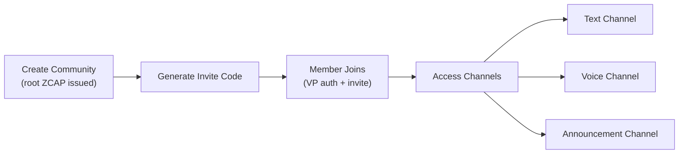

### RDF Quad Storage Model

```mermaid
graph TB
    subgraph "Quad: (Subject, Predicate, Object, Graph)"
        Q1["(community:abc, harmony:name, 'My Server', community:abc)"]
        Q2["(community:abc, harmony:hasMember, did:key:z6Mk..., community:abc)"]
        Q3["(channel:xyz, harmony:type, 'text', community:abc)"]
        Q4["(message:123, harmony:content, 'Hello!', channel:xyz)"]
        Q5["(role:admin, harmony:hasPermission, 'channel.create', community:abc)"]
    end
```

### Role System

```mermaid
flowchart LR
    Admin["Admin Role"] -->|assign| Member["Member DID"]
    Admin -->|create/delete| Roles["Custom Roles"]
    Roles -->|grant| Perms["Permissions<br/>(message.send, channel.create, ...)"]
    Server["Server"] -->|check on every action| Perms
```

---

## 10. Voice & Video (WebRTC + mediasoup SFU)

### SFU Topology

```mermaid
graph LR
    subgraph "Client A"
        ProducerA["Audio/Video Producer"]
        ConsumerA["Remote Consumers"]
    end

    subgraph "mediasoup Router"
        SendTransportA["Send Transport A"]
        RecvTransportA["Recv Transport A"]
        SendTransportB["Send Transport B"]
        RecvTransportB["Recv Transport B"]
    end

    subgraph "Client B"
        ProducerB["Audio/Video Producer"]
        ConsumerB["Remote Consumers"]
    end

    ProducerA --> SendTransportA --> RecvTransportB --> ConsumerB
    ProducerB --> SendTransportB --> RecvTransportA --> ConsumerA
```

### Voice Join Flow

```mermaid
sequenceDiagram
    participant Client
    participant Server
    participant SFU["mediasoup Router"]

    Client->>Server: voice.token (channel ID)
    Server->>Client: Router RTP capabilities
    Client->>Server: Create Send Transport
    Client->>Server: Create Recv Transport
    Client->>SFU: Produce audio track
    SFU->>Server: New producer available
    Server->>Client: Consume remote producers
    Client->>Client: AnalyserNode → speaking detection
    Client->>Server: voice.speaking { speaking: true }
```

### Mute / Deafen Lifecycle

```mermaid
stateDiagram-v2
    [*] --> Active
    Active --> Muted: mute()
    Muted --> Active: unmute()
    Active --> Deafened: deafen()
    Deafened --> Active: undeafen()
    Muted --> Deafened: deafen()

    state Active {
        [*] --> Producing
        Producing: Audio producer active
    }
    state Muted {
        [*] --> ProducerStopped
        ProducerStopped: Producer + tracks stopped
    }
    state Deafened {
        [*] --> AllPaused
        AllPaused: All consumers paused
    }
```

> Note: `SFUAdapter` is a pluggable interface — mediasoup for self-hosted, Cloudflare Realtime for cloud. E2EE via Insertable Streams is designed but not fully wired.

---

## 11. Data Storage Layer

### QuadStore Implementations

```mermaid
graph TB
    Interface["QuadStore Interface<br/>(add, remove, match, query)"]
    Interface --> Memory["MemoryQuadStore<br/>(client-side)"]
    Interface --> SQLiteQS["SQLiteQuadStore<br/>(server-runtime)"]
    Interface --> DOQS["DOQuadStore<br/>(cloud worker DO SQLite)"]

    subgraph "Stored as Quads"
        Communities["Communities"]
        Channels["Channels"]
        Members["Members"]
        Messages["Messages"]
        Roles["Roles & Permissions"]
        DIDs["DID Documents"]
    end

    Interface --> Communities
    Interface --> Channels
    Interface --> Members
    Interface --> Messages
```

### Vocabulary Layer

```mermaid
graph LR
    Vocab["@harmony/vocab"]
    Vocab --> NS["Namespaces<br/>(harmony:, did:, vc:, zcap:)"]
    Vocab --> Pred["Predicates<br/>(harmony:name, harmony:hasMember,<br/>harmony:content, harmony:type, ...)"]
    Vocab --> Types["Types<br/>(Community, Channel, Message, Role)"]
```

---

## 12. Reconnection & Offline

```mermaid
sequenceDiagram
    participant Client
    participant Server

    Client->>Server: WebSocket connected
    Note over Client,Server: Normal operation

    Server--xClient: Connection drops

    loop Exponential Backoff
        Client->>Client: Wait (1s, 2s, 4s, 8s...)
        Client->>Server: Reconnect attempt
    end

    Client->>Server: WebSocket reconnected
    Client->>Server: sync.state (VP + last known state)
    Server->>Client: Full state restoration

    Client->>Client: Drain offline message queue
    Client->>Server: Buffered messages sent
```

### Multi-Server Topology

```mermaid
graph TB
    Client["Client"]
    Client --> S1["Server 1 ✓"]
    Client --> S2["Server 2 ✗ (dropped)"]
    Client --> S3["Server 3 ✓"]

    Client -->|status| Connected["Status: connected<br/>(not reconnecting)"]

    Note["Partial disconnect: some servers<br/>drop but others remain — client<br/>shows 'connected' not 'reconnecting'"]
```

---

## 13. Discord Migration

### Export & Import Flow

```mermaid
sequenceDiagram
    participant MigrationBot
    participant Discord
    participant Server
    participant Harmony

    Note over MigrationBot,Discord: Export Phase
    MigrationBot->>Discord: Join server
    MigrationBot->>Discord: Fetch channels, messages, attachments, threads, reactions
    MigrationBot->>MigrationBot: Transform to RDF quads
    MigrationBot->>MigrationBot: Encrypt bundle
    MigrationBot->>Server: Upload encrypted bundle (R2)

    Note over Server,Harmony: Import Phase
    Server->>Server: Decrypt bundle
    Server->>Server: Insert quads
    Server->>Server: Map Discord users → DIDs (ghost members for unmapped)
    Server->>Server: Hash-based dedup (prevent re-import)
    Server->>Harmony: Community populated
```

---

## 14. Portal Services

```mermaid
graph TB
    subgraph "Portal Worker (Cloudflare)"
        IdStore["Identity Store<br/>(D1: DID registration + lookup)"]
        Directory["Community Directory<br/>(discover public communities)"]
        Invites["Invite Resolver<br/>(short codes → connection info)"]
        OAuth["OAuth Handler<br/>(Discord OAuth for identity linking)"]
        RateLimit["Rate Limiter<br/>(KV: per-DID limiting)"]
        Relay["Relay<br/>(DO: WebSocket proxy for restrictive NATs)"]
        ExportStore["Export Store<br/>(R2: encrypted Discord bundles)"]
    end

    Client["Clients"] -->|DID lookup| IdStore
    Client -->|discover| Directory
    Client -->|resolve invite| Invites
    Client -->|link Discord| OAuth
    Client -.->|rate limited| RateLimit
    Client -->|NAT traversal| Relay
    MigBot["Migration Bot"] -->|upload| ExportStore
```

---

## 15. Search Architecture

```mermaid
graph TB
    subgraph "Client-Side FTS"
        Decrypt["Decrypt Messages<br/>(E2EE — server can't see plaintext)"]
        Tokenizer["Tokenizer"]
        Index["Inverted Index"]
        QueryParser["Query Parser"]
        Decrypt --> Tokenizer --> Index
        QueryParser --> Index
    end

    subgraph "Server-Side"
        MetaSearch["Metadata Search<br/>(timestamps, senders, channels)"]
    end

    subgraph "UI"
        Overlay["Search Overlay"]
        Results["Result Navigation"]
        Highlights["Highlights"]
        Overlay --> Results --> Highlights
    end

    Index --> Overlay
    MetaSearch --> Overlay
```

> Note: Full-text search of message content is client-side only (E2EE constraint). Server can only search metadata. 39 tests cover the tokenizer, index, and query parser.

---

## 16. Moderation System

```mermaid
flowchart TD
    Action["Incoming Action"] --> BanCheck{"Banned?"}
    BanCheck -->|Yes| Block["Block"]
    BanCheck -->|No| RateCheck{"Rate Limited?"}
    RateCheck -->|Yes| Block
    RateCheck -->|No| SlowMode{"Slow Mode Cooldown?"}
    SlowMode -->|Active| Block
    SlowMode -->|Clear| AgeCheck{"DID Age Sufficient?"}
    AgeCheck -->|No| Block
    AgeCheck -->|Yes| VCCheck{"Required VCs Present?"}
    VCCheck -->|No| Block
    VCCheck -->|Yes| Allow["✓ Allow"]

    RaidDetect["Raid Detection<br/>(rapid join threshold)"] -->|triggered| AutoLock["Auto-Lockdown"]
```

---

## 17. Notification System

```mermaid
sequenceDiagram
    participant Sender
    participant Server
    participant Recipient

    Sender->>Server: message.send (contains @mention or is DM/reply)
    Server->>Server: Detect mention (@username or @did:key:...)
    Server->>Server: Create notification record
    Server->>Recipient: Push via WebSocket

    Recipient->>Server: notification.list
    Server->>Recipient: Unread notifications

    Recipient->>Server: notification.mark-read { id }
    Recipient->>Server: notification.mark-all-read
    Recipient->>Server: notification.count
```

### UI Components

```mermaid
graph LR
    Bell["NotificationBell<br/>(unread count badge)"]
    Bell -->|click| Dropdown["Notification Dropdown<br/>(list of notifications)"]
    Dropdown --> MarkRead["Mark Read"]
    Dropdown --> MarkAll["Mark All Read"]
    Dropdown --> Navigate["Navigate to Message"]
```

---

## 18. Build & Deployment

```mermaid
graph TB
    subgraph "pnpm Monorepo (36 packages)"
        Source["TypeScript Source"]
    end

    Source --> Electron["Electron<br/>esbuild → electron-builder<br/>→ DMG / AppImage"]
    Source --> Docker["Docker<br/>server-runtime image"]
    Source --> CF["Cloudflare<br/>wrangler deploy<br/>portal-worker + cloud-worker"]
    Source --> Cap["Capacitor<br/>Android APK / iOS IPA"]

    subgraph "CI Pipeline"
        Vitest["vitest<br/>(2582 tests)"]
        Playwright["Playwright<br/>(99 E2E tests)"]
        Lint["oxlint"]
        TSC["tsc (type check)"]
    end

    Source --> Vitest
    Source --> Playwright
    Source --> Lint
    Source --> TSC
```

### Electron Build Detail

```mermaid
flowchart LR
    MainTS["main process TS"] -->|esbuild| Bundle["harmony-app.js"]
    Preload["preload.ts"] -->|esbuild| PreloadJS["preload.js<br/>(contextBridge → __HARMONY_DESKTOP__)"]
    UIApp["ui-app build"] --> Renderer["BrowserWindow renderer"]
    Bundle --> ElectronBuilder["electron-builder"]
    PreloadJS --> ElectronBuilder
    Renderer --> ElectronBuilder
    ElectronBuilder --> DMG["DMG (macOS)"]
    ElectronBuilder --> AppImage["AppImage (Linux)"]

    Note["nodeIntegration: false<br/>contextIsolation: true"]
```

---

> **Architecture maintained by the Harmony team. Diagrams generated from codebase analysis — update when the structure changes.**
