# Harmony Platform Architecture

> A sovereign, decentralized real-time communication platform built on DIDs, Verifiable Credentials, ZCAP authorization, and end-to-end encryption.

---

## 1. System Overview

Harmony runs across five deployment targets sharing a common UI and protocol layer.

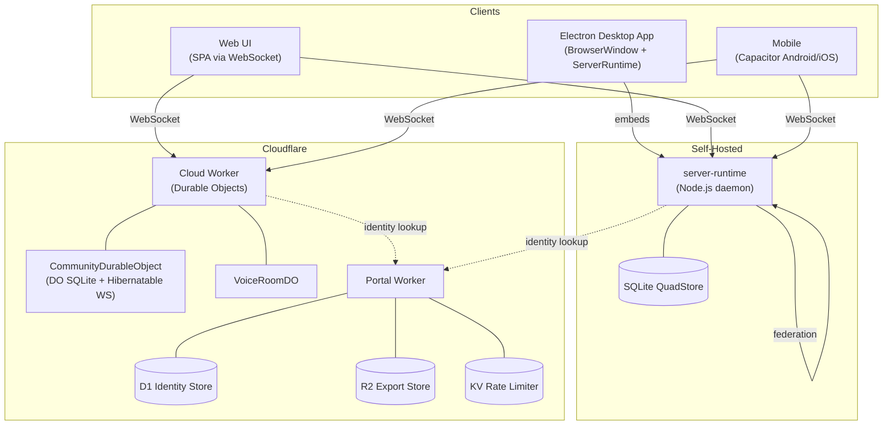

> Note: The Electron app embeds `ServerRuntime` in the main process — it functions as both client and server simultaneously. Web and Mobile clients connect to remote servers.

### Deployment Target Summary

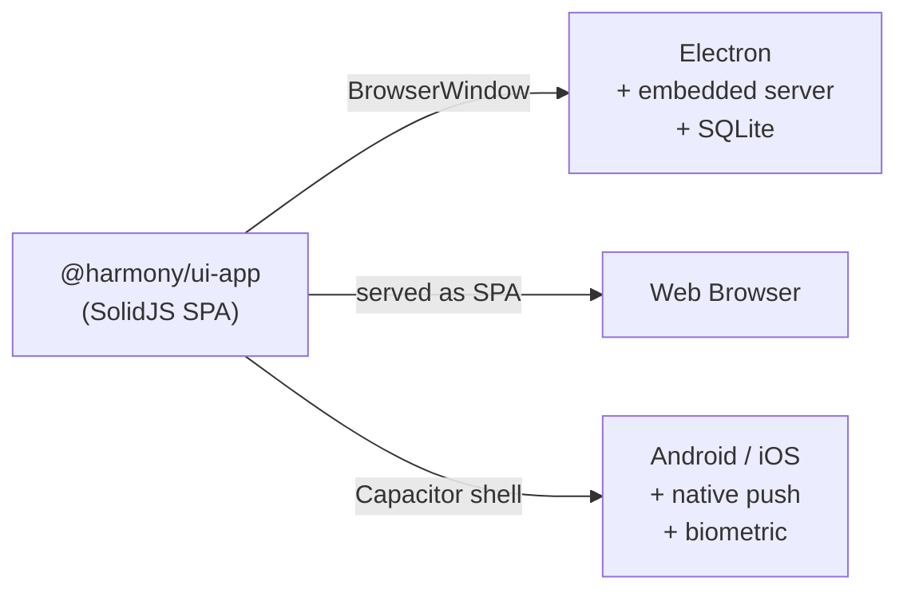

---

## 2. Package Dependency Graph

36 packages organised in five layers. Key dependency edges shown (not exhaustive).

### Core Layer

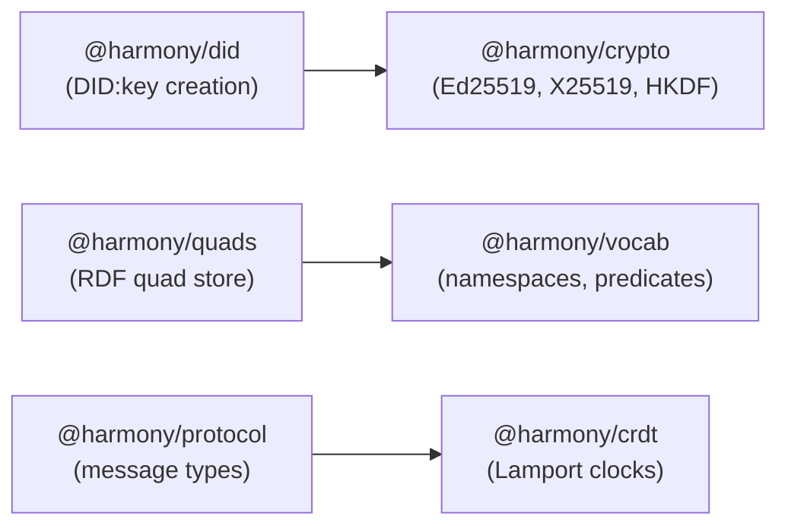

### Identity, Auth & Communication Layers

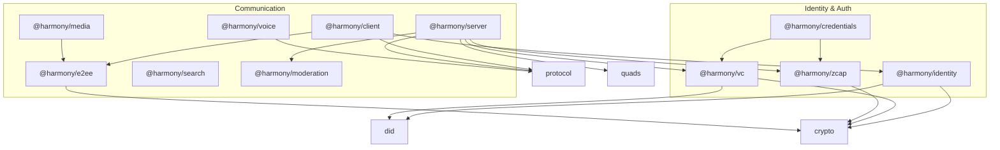

### Infrastructure & Application Layers

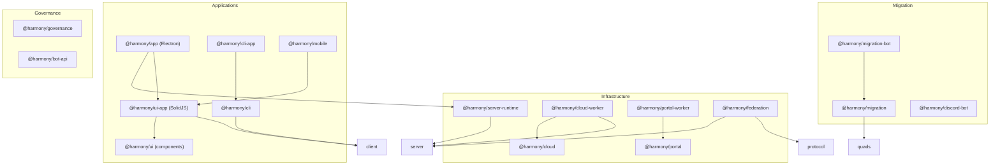

---

## 3. Identity & DID System

### DID Creation Flow

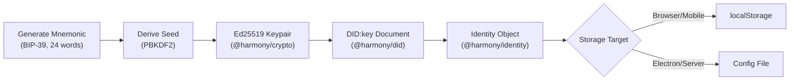

### DID Document Structure

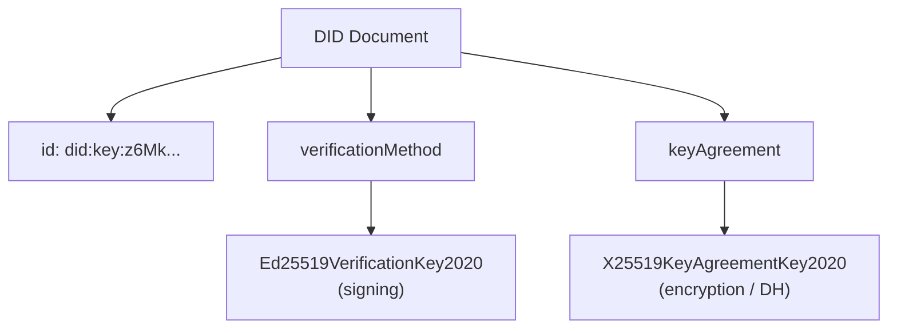

### Social Recovery Flow

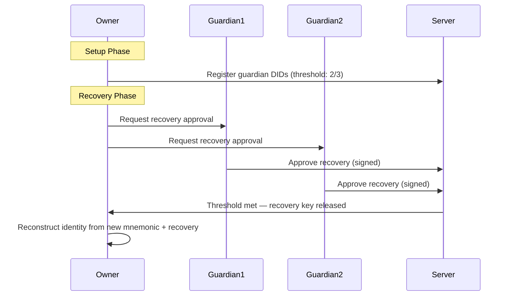

> Note: `@harmony/crypto` provides all primitives (Ed25519, X25519, HKDF). `@harmony/did` creates DID documents. `@harmony/identity` manages the full lifecycle including persistence and recovery.

---

## 4. Verifiable Credentials (VCs)

### VC Issuance & Verification

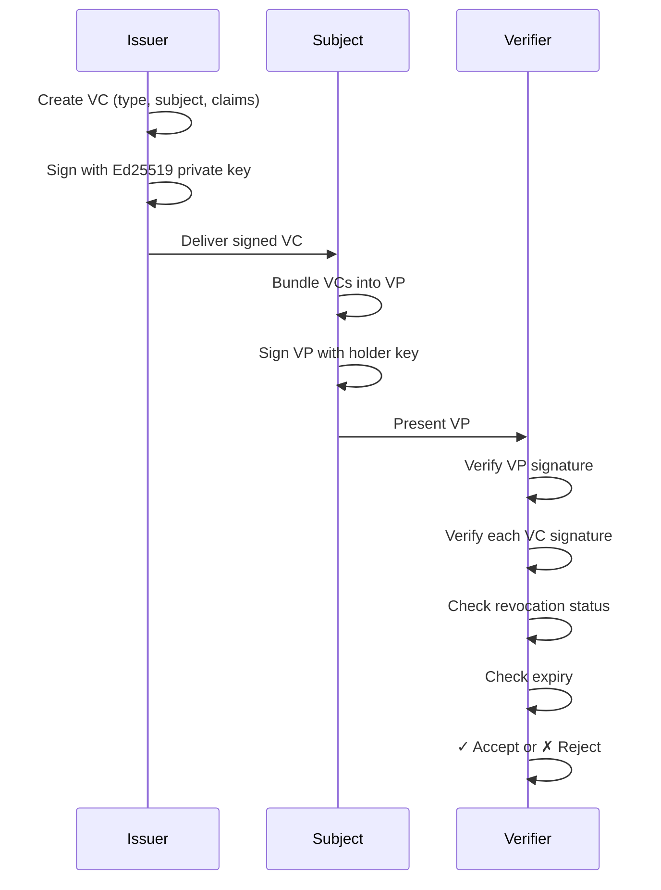

### VC Types & Policy

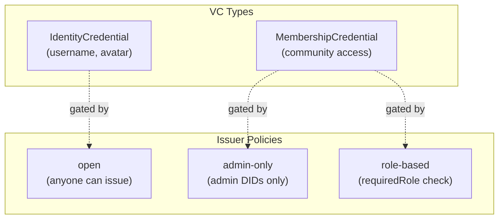

> Note: Revocation store is currently in-memory. Future work includes persistent revocation, VC-based community admission gates, cross-community trust chains, and E2EE key binding to VCs.

---

## 5. ZCAP (Authorization Capabilities)

### Capability Delegation Chain

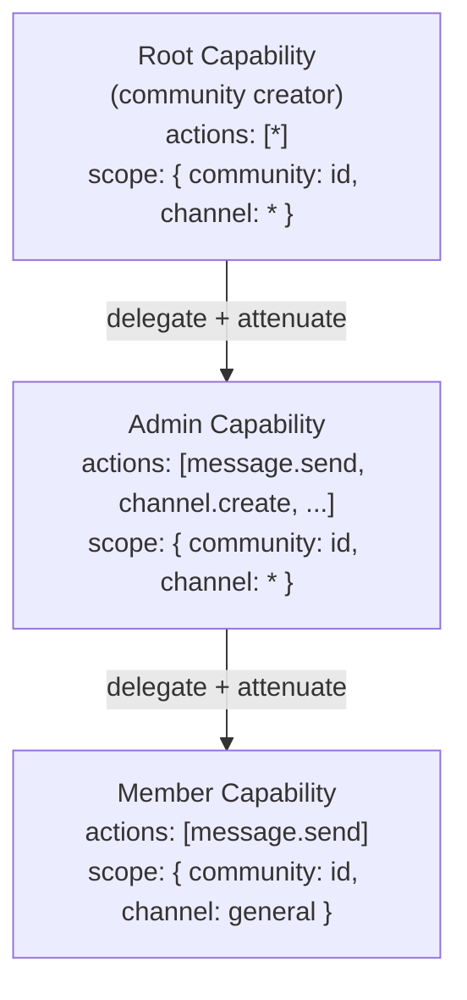

### Server ZCAP Verification

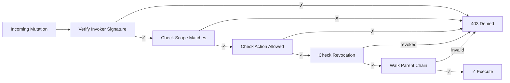

> Note: Every mutation passes through ZCAP verification. Caveats (time-limited, rate-limited) are designed but not yet enforced.

---

## 6. Authentication Flow (VP Handshake)

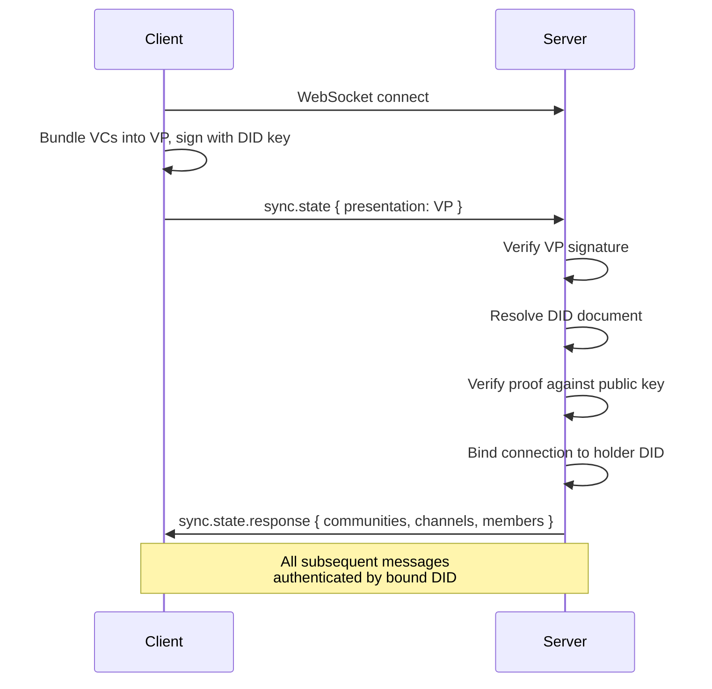

> Note: The VP handshake replaces traditional username/password login. The server never sees private keys — only signed proofs.

---

## 7. End-to-End Encryption

### 7a. MLS for Channel Messages

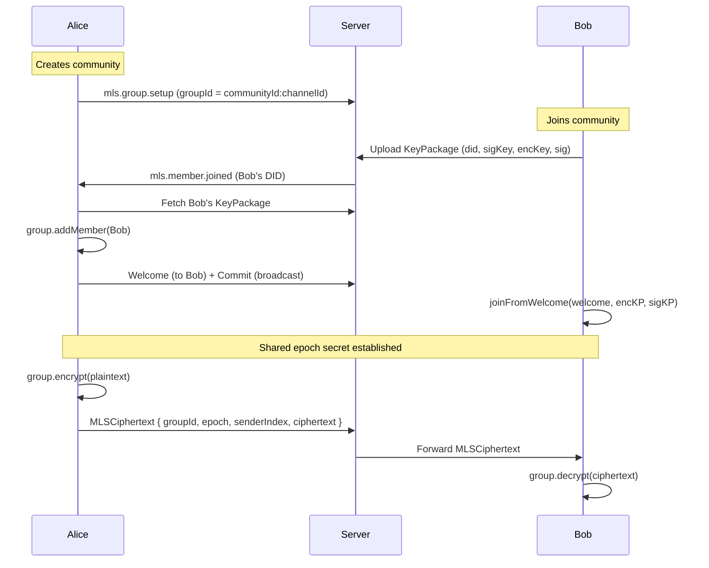

### MLS Epoch Model

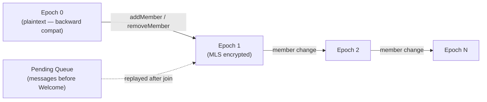

> Note: Epoch 0 means plaintext (for backward compatibility). Epoch > 0 = MLS encrypted. `processCommit` guards against stale epochs. Client dedup via `_pendingMemberDIDs` Map.

### 7b. DM Encryption (X25519 + XChaCha20-Poly1305)

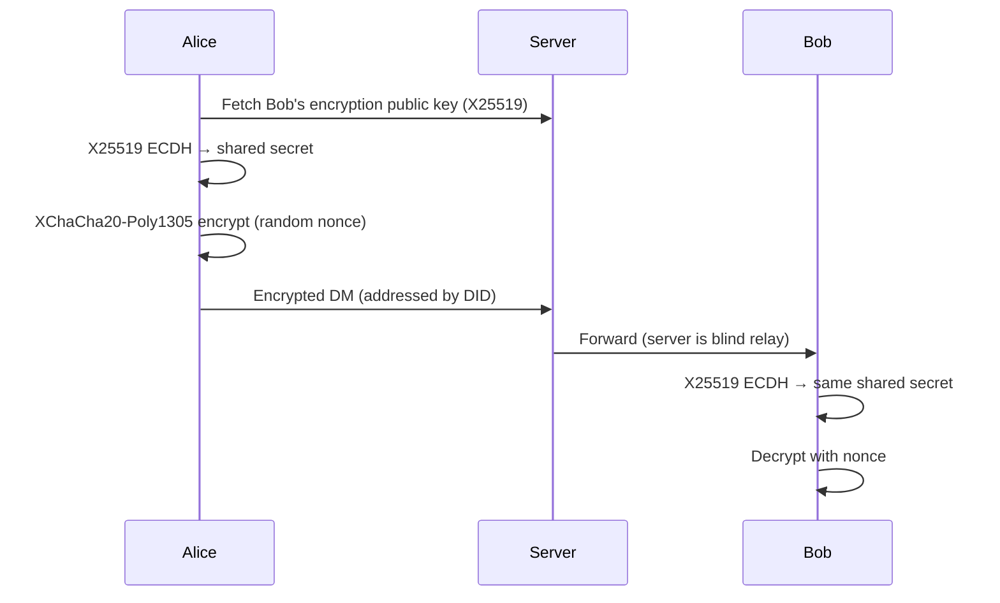

### 7c. Media Encryption

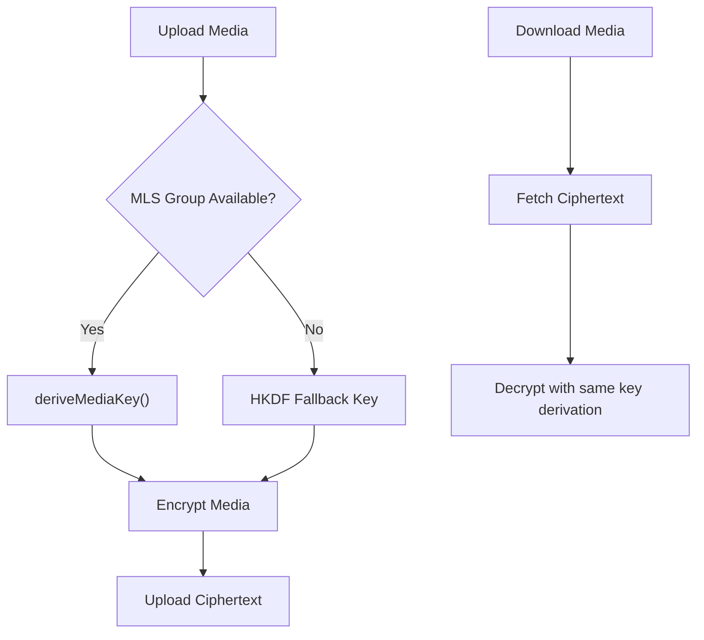

---

## 8. Message Flow & Protocol

### Channel Message Path

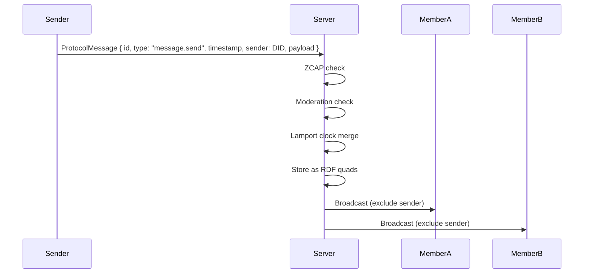

### ProtocolMessage Structure

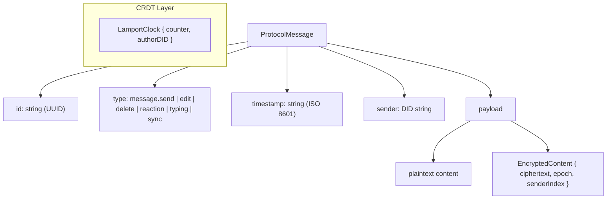

> Note: The ProtocolMessage timestamp is an ISO 8601 string. Lamport clocks operate in the CRDT layer for causal ordering of state mutations, separate from message timestamps. The CRDT layer ensures convergent state even with out-of-order delivery.

---

## 9. Community & Channel Architecture

### Community Lifecycle

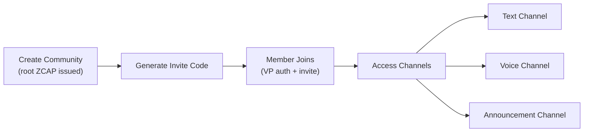

### RDF Quad Storage Model

```mermaid
graph TB
    subgraph "Quad: (Subject, Predicate, Object, Graph)"
        Q1["(community:abc, harmony:name, 'My Server', community:abc)"]
        Q2["(community:abc, harmony:hasMember, did:key:z6Mk..., community:abc)"]
        Q3["(channel:xyz, harmony:type, 'text', community:abc)"]
        Q4["(message:123, harmony:content, 'Hello!', channel:xyz)"]
        Q5["(role:admin, harmony:hasPermission, 'channel.create', community:abc)"]
    end
```

### Role System

```mermaid
flowchart LR
    Admin["Admin Role"] -->|assign| Member["Member DID"]
    Admin -->|create/delete| Roles["Custom Roles"]
    Roles -->|grant| Perms["Permissions<br/>(message.send, channel.create, ...)"]
    Server["Server"] -->|check on every action| Perms
```

---

## 10. Voice & Video (WebRTC + mediasoup SFU)

### SFU Topology

```mermaid
graph LR
    subgraph "Client A"
        ProducerA["Audio/Video Producer"]
        ConsumerA["Remote Consumers"]
    end

    subgraph "mediasoup Router"
        SendTransportA["Send Transport A"]
        RecvTransportA["Recv Transport A"]
        SendTransportB["Send Transport B"]
        RecvTransportB["Recv Transport B"]
    end

    subgraph "Client B"
        ProducerB["Audio/Video Producer"]
        ConsumerB["Remote Consumers"]
    end

    ProducerA --> SendTransportA --> RecvTransportB --> ConsumerB
    ProducerB --> SendTransportB --> RecvTransportA --> ConsumerA
```

### Voice Join Flow

```mermaid
sequenceDiagram
    participant Client
    participant Server
    participant SFU["mediasoup Router"]

    Client->>Server: voice.token (channel ID)
    Server->>Client: Router RTP capabilities
    Client->>Server: Create Send Transport
    Client->>Server: Create Recv Transport
    Client->>SFU: Produce audio track
    SFU->>Server: New producer available
    Server->>Client: Consume remote producers
    Client->>Client: AnalyserNode → speaking detection
    Client->>Server: voice.speaking { speaking: true }
```

### Mute / Deafen Lifecycle

```mermaid
stateDiagram-v2
    [*] --> Active
    Active --> Muted: mute()
    Muted --> Active: unmute()
    Active --> Deafened: deafen()
    Deafened --> Active: undeafen()
    Muted --> Deafened: deafen()

    state Active {
        [*] --> Producing
        Producing: Audio producer active
    }
    state Muted {
        [*] --> ProducerStopped
        ProducerStopped: Producer + tracks stopped
    }
    state Deafened {
        [*] --> AllPaused
        AllPaused: All consumers paused
    }
```

> Note: `SFUAdapter` is a pluggable interface — mediasoup for self-hosted, Cloudflare Realtime for cloud. E2EE via Insertable Streams is designed but not fully wired.

---

## 11. Data Storage Layer

### QuadStore Implementations

```mermaid
graph TB
    Interface["QuadStore Interface<br/>(add, remove, match, query)"]
    Interface --> Memory["MemoryQuadStore<br/>(client-side)"]
    Interface --> SQLiteQS["SQLiteQuadStore<br/>(server-runtime)"]
    Interface --> DOQS["DOQuadStore<br/>(cloud worker DO SQLite)"]

    subgraph "Stored as Quads"
        Communities["Communities"]
        Channels["Channels"]
        Members["Members"]
        Messages["Messages"]
        Roles["Roles & Permissions"]
        DIDs["DID Documents"]
    end

    Interface --> Communities
    Interface --> Channels
    Interface --> Members
    Interface --> Messages
```

### Vocabulary Layer

```mermaid
graph LR
    Vocab["@harmony/vocab"]
    Vocab --> NS["Namespaces<br/>(harmony:, did:, vc:, zcap:)"]
    Vocab --> Pred["Predicates<br/>(harmony:name, harmony:hasMember,<br/>harmony:content, harmony:type, ...)"]
    Vocab --> Types["Types<br/>(Community, Channel, Message, Role)"]
```

---

## 12. Reconnection & Offline

```mermaid
sequenceDiagram
    participant Client
    participant Server

    Client->>Server: WebSocket connected
    Note over Client,Server: Normal operation

    Server--xClient: Connection drops

    loop Exponential Backoff
        Client->>Client: Wait (1s, 2s, 4s, 8s...)
        Client->>Server: Reconnect attempt
    end

    Client->>Server: WebSocket reconnected
    Client->>Server: sync.state (VP + last known state)
    Server->>Client: Full state restoration

    Client->>Client: Drain offline message queue
    Client->>Server: Buffered messages sent
```

### Multi-Server Topology

```mermaid
graph TB
    Client["Client"]
    Client --> S1["Server 1 ✓"]
    Client --> S2["Server 2 ✗ (dropped)"]
    Client --> S3["Server 3 ✓"]

    Client -->|status| Connected["Status: connected<br/>(not reconnecting)"]

    Note["Partial disconnect: some servers<br/>drop but others remain — client<br/>shows 'connected' not 'reconnecting'"]
```

---

## 13. Discord Migration

### Export & Import Flow

```mermaid
sequenceDiagram
    participant MigrationBot
    participant Discord
    participant Server
    participant Harmony

    Note over MigrationBot,Discord: Export Phase
    MigrationBot->>Discord: Join server
    MigrationBot->>Discord: Fetch channels, messages, attachments, threads, reactions
    MigrationBot->>MigrationBot: Transform to RDF quads
    MigrationBot->>MigrationBot: Encrypt bundle
    MigrationBot->>Server: Upload encrypted bundle (R2)

    Note over Server,Harmony: Import Phase
    Server->>Server: Decrypt bundle
    Server->>Server: Insert quads
    Server->>Server: Map Discord users → DIDs (ghost members for unmapped)
    Server->>Server: Hash-based dedup (prevent re-import)
    Server->>Harmony: Community populated
```

---

## 14. Portal Services

```mermaid
graph TB
    subgraph "Portal Worker (Cloudflare)"
        IdStore["Identity Store<br/>(D1: DID registration + lookup)"]
        Directory["Community Directory<br/>(discover public communities)"]
        Invites["Invite Resolver<br/>(short codes → connection info)"]
        OAuth["OAuth Handler<br/>(Discord OAuth for identity linking)"]
        RateLimit["Rate Limiter<br/>(KV: per-DID limiting)"]
        Relay["Relay<br/>(DO: WebSocket proxy for restrictive NATs)"]
        ExportStore["Export Store<br/>(R2: encrypted Discord bundles)"]
    end

    Client["Clients"] -->|DID lookup| IdStore
    Client -->|discover| Directory
    Client -->|resolve invite| Invites
    Client -->|link Discord| OAuth
    Client -.->|rate limited| RateLimit
    Client -->|NAT traversal| Relay
    MigBot["Migration Bot"] -->|upload| ExportStore
```

---

## 15. Search Architecture

```mermaid
graph TB
    subgraph "Client-Side FTS"
        Decrypt["Decrypt Messages<br/>(E2EE — server can't see plaintext)"]
        Tokenizer["Tokenizer"]
        Index["Inverted Index"]
        QueryParser["Query Parser"]
        Decrypt --> Tokenizer --> Index
        QueryParser --> Index
    end

    subgraph "Server-Side"
        MetaSearch["Metadata Search<br/>(timestamps, senders, channels)"]
    end

    subgraph "UI"
        Overlay["Search Overlay"]
        Results["Result Navigation"]
        Highlights["Highlights"]
        Overlay --> Results --> Highlights
    end

    Index --> Overlay
    MetaSearch --> Overlay
```

> Note: Full-text search of message content is client-side only (E2EE constraint). Server can only search metadata. 39 tests cover the tokenizer, index, and query parser.

---

## 16. Moderation System

```mermaid
flowchart TD
    Action["Incoming Action"] --> BanCheck{"Banned?"}
    BanCheck -->|Yes| Block["Block"]
    BanCheck -->|No| RateCheck{"Rate Limited?"}
    RateCheck -->|Yes| Block
    RateCheck -->|No| SlowMode{"Slow Mode Cooldown?"}
    SlowMode -->|Active| Block
    SlowMode -->|Clear| AgeCheck{"DID Age Sufficient?"}
    AgeCheck -->|No| Block
    AgeCheck -->|Yes| VCCheck{"Required VCs Present?"}
    VCCheck -->|No| Block
    VCCheck -->|Yes| Allow["✓ Allow"]

    RaidDetect["Raid Detection<br/>(rapid join threshold)"] -->|triggered| AutoLock["Auto-Lockdown"]
```

---

## 17. Notification System

```mermaid
sequenceDiagram
    participant Sender
    participant Server
    participant Recipient

    Sender->>Server: message.send (contains @mention or is DM/reply)
    Server->>Server: Detect mention (@username or @did:key:...)
    Server->>Server: Create notification record
    Server->>Recipient: Push via WebSocket

    Recipient->>Server: notification.list
    Server->>Recipient: Unread notifications

    Recipient->>Server: notification.mark-read { id }
    Recipient->>Server: notification.mark-all-read
    Recipient->>Server: notification.count
```

### UI Components

```mermaid
graph LR
    Bell["NotificationBell<br/>(unread count badge)"]
    Bell -->|click| Dropdown["Notification Dropdown<br/>(list of notifications)"]
    Dropdown --> MarkRead["Mark Read"]
    Dropdown --> MarkAll["Mark All Read"]
    Dropdown --> Navigate["Navigate to Message"]
```

---

## 18. Build & Deployment

```mermaid
graph TB
    subgraph "pnpm Monorepo (36 packages)"
        Source["TypeScript Source"]
    end

    Source --> Electron["Electron<br/>esbuild → electron-builder<br/>→ DMG / AppImage"]
    Source --> Docker["Docker<br/>server-runtime image"]
    Source --> CF["Cloudflare<br/>wrangler deploy<br/>portal-worker + cloud-worker"]
    Source --> Cap["Capacitor<br/>Android APK / iOS IPA"]

    subgraph "CI Pipeline"
        Vitest["vitest<br/>(2582 tests)"]
        Playwright["Playwright<br/>(99 E2E tests)"]
        Lint["oxlint"]
        TSC["tsc (type check)"]
    end

    Source --> Vitest
    Source --> Playwright
    Source --> Lint
    Source --> TSC
```

### Electron Build Detail

```mermaid
flowchart LR
    MainTS["main process TS"] -->|esbuild| Bundle["harmony-app.js"]
    Preload["preload.ts"] -->|esbuild| PreloadJS["preload.js<br/>(contextBridge → __HARMONY_DESKTOP__)"]
    UIApp["ui-app build"] --> Renderer["BrowserWindow renderer"]
    Bundle --> ElectronBuilder["electron-builder"]
    PreloadJS --> ElectronBuilder
    Renderer --> ElectronBuilder
    ElectronBuilder --> DMG["DMG (macOS)"]
    ElectronBuilder --> AppImage["AppImage (Linux)"]

    Note["nodeIntegration: false<br/>contextIsolation: true"]
```

---

## 19. Server & Connection Discovery

Clients don't discover servers autonomously — the `HarmonyClient.connect(url, options?)` method requires a WebSocket URL. Discovery happens at the UI/application layer through five distinct paths.

### Discovery Paths

```mermaid
graph TB
    User([User])

    subgraph "Discovery Paths"
        Embedded["🖥️ Electron Embedded<br/>auto-start ServerRuntime<br/>→ ws://localhost:{port}"]
        Manual["⌨️ Manual URL Entry<br/>Advanced option in UI"]
        Invite["🔗 Invite Code<br/>Short code → Portal lookup"]
        Directory["📋 Community Directory<br/>Browse public communities"]
        Relay["🔀 Relay Proxy<br/>NAT traversal via Portal"]
    end

    subgraph "Portal Worker (Cloudflare)"
        InviteReg["InviteRegistryDO"]
        CommunityReg["CommunityRegistryDO"]
        RelayDO["RelayDO<br/>WebSocket proxy"]
    end

    Server["Harmony Server"]

    User --> Embedded --> Server
    User --> Manual --> Server
    User --> Invite --> InviteReg --> Server
    User --> Directory --> CommunityReg --> Server
    User --> Relay --> RelayDO --> Server
```

### Connection Flow

1. **Electron embedded** — `ServerRuntime` starts in-process on port 4515 (host `0.0.0.0`). After the window loads, `harmony:server-started` IPC sends the server URL. The renderer calls `window.__HARMONY_DESKTOP__.waitForServer()` then `store.addServer(serverUrl)` to auto-connect. Identity is restored from disk-persisted config.

2. **Persisted server reconnect** — `LocalStoragePersistence` saves `{ servers: [{ url, communityIds[] }], did, encryptionKeyPair }`. On `HarmonyClient.create()`, the client auto-reconnects to all previously-saved servers. This is the primary reconnection path for web clients across sessions.

3. **Manual URL entry** — `store.addServer(url)` / `client.addServer(url)` connects to any server URL. Used by the migration wizard and available as a manual option post-onboarding (not in the onboarding flow itself).

4. **Invite code resolution** — The primary social discovery path:

```mermaid
sequenceDiagram
    participant U as User
    participant UI as UI App
    participant PC as PortalClient
    participant PW as Portal Worker
    participant IR as InviteRegistryDO
    participant S as Harmony Server

    U->>UI: Enter invite code "abc123"
    UI->>PC: resolveInvite("abc123")
    PC->>PW: GET /invite/abc123
    PW->>IR: lookup(code)
    IR-->>PW: {serverUrl, communityId, communityName}
    PW-->>PC: InviteResolution
    PC-->>UI: {serverUrl, inviteCode}
    UI->>S: WebSocket connect + community.join with VP & inviteCode
    S-->>UI: Community state (channels, members, roles)
```

4. **Community directory** — Portal Worker `directory.list()` returns communities with endpoints (name, description, member count, server URL). Servers self-register via `directory.register()` with `{ communityId, name, endpoint, memberCount, inviteCode, ownerDID }`. Backend fully implemented; UI browse integration not yet visible in onboarding.

5. **Relay fallback** — `RelayDurableObject` provides bidirectional WebSocket proxy for NAT traversal. Node connects first, then clients connect and messages are proxied. Currently **scaffolded but not production-enabled** (`relay: { enabled: false }` in server config).

### Multi-Server Architecture

`HarmonyClient` supports simultaneous connections to multiple servers via `_servers: Map<string, ServerConnection>`. A `_communityServerMap` tracks which community lives on which server. The `connect()` method takes `{ serverUrl, identity, keyPair, vp? }` — if no VP is provided, one is auto-created from the identity/keyPair.

### Invite Code Detail

When a server creates an invite with `portal: true`, the portal-worker's `invite-resolver` stores the mapping: short code → `{ communityId, endpoint, preview: { name, description, memberCount } }`. Invite codes support expiry, max uses, revocation, and use counting.

### First Launch (Onboarding)

The `OnboardingView` offers four paths:

1. **Create Identity** → generates mnemonic → backup quiz → setup (display name + optional Discord link via portal OAuth)
2. **Recover Identity** → enter 12-word mnemonic OR social recovery (initiation works; completion not yet connected to backend)
3. **Import from Discord** → create identity first, then MigrationWizard
4. **Sign in via Portal** → portal URL input, Discord OAuth, identity creation + linking

Server connection happens **separately** from onboarding — via embedded auto-connect (desktop), persisted reconnect, or manual `addServer()`.

### Implementation Status

| Path                           | Status                                                |
| ------------------------------ | ----------------------------------------------------- |
| Electron embedded auto-connect | ✅ Implemented                                        |
| Persisted server reconnect     | ✅ Implemented                                        |
| Manual server URL              | ✅ Implemented                                        |
| Invite code resolution         | ✅ Implemented                                        |
| Community directory            | ✅ Backend implemented; UI browse partial             |
| Portal OAuth sign-in           | ✅ Implemented                                        |
| Relay proxy (NAT traversal)    | 🟡 Scaffolded (`enabled: false`)                      |
| Federation                     | 🟡 Scaffolded (`enabled: false`)                      |
| Deep links (`harmony://`)      | ⚠️ Electron only (handles OAuth + generic deep links) |
| QR code sharing                | ❌ Planned                                            |
| Local network discovery (mDNS) | ❌ Not implemented                                    |

> **Note:** Auto-reconnect uses max 5 attempts. The `LocalStoragePersistence` adapter ensures web clients reconnect to all saved servers across sessions.

---

## 20. Data Durability & Backup

### Data Locations

```mermaid
graph TB
    subgraph "Client (Browser/Electron Renderer)"
        LS["localStorage<br/>harmony:client:state"]
        Mem["In-Memory (ephemeral)"]
    end

    subgraph "localStorage Contents"
        ID["did + mnemonic"]
        EK["encryptionKeyPair<br/>X25519 (publicKey + secretKey)"]
        SL["servers<br/>[{url, communityIds[]}]"]
    end

    subgraph "In-Memory (lost on refresh)"
        MQ["Channel logs, DM channels,<br/>thread messages"]
        MLS["mlsGroups Map<br/>Epoch keys"]
    end

    LS --- ID
    LS --- EK
    LS --- SL
    Mem --- MQ
    Mem --- MLS

    subgraph "Server (SQLite + filesystem)"
        DB["harmony.db (WAL mode)<br/>Quads: messages, channels,<br/>roles, members"]
        ATT["./media/<br/>Uploaded files"]
        BK["backup(path)<br/>Hot backup available"]
    end

    subgraph "Cloud Worker (Cloudflare)"
        DO["DO SQLite<br/>Quads + members/channels/<br/>voice/keypackages tables"]
        R2["R2 Bucket<br/>Media attachments"]
    end

    DB -.->|"better-sqlite3<br/>.backup()"| BK
```

### Server Storage Detail

- **SQLite config:** WAL mode, `synchronous = NORMAL`, foreign keys enabled
- **Database path:** Configurable via `storage.database` in YAML config (default `./harmony.db`)
- **Hot backup:** `ServerRuntime` exposes a `backup(path)` method using better-sqlite3's online backup API — but **nothing calls it on a schedule**
- **Compaction:** `compact()` method runs VACUUM + WAL checkpoint
- **Stats:** Size tracking available via `stats()` method

### Client Persistence Detail

All client state persisted under `localStorage` key `harmony:client:state` as a single `PersistedState` object:

- `did` — user's DID string
- `servers` — array of `{ url, communityIds[] }`
- `encryptionKeyPair` — `{ publicKey: number[], secretKey: number[] }` (X25519)

Everything else is **in-memory only**: channel message logs, DM channels, thread messages, MLS group state (`mlsGroups` Map). Closing the tab loses all message cache and E2EE state.

### Durability by Deployment

| Deployment | Data Store | Durability | Risk |
| --- | --- | --- | --- |
| **Electron** | SQLite in app data dir (e.g. `~/Library/Application Support/Harmony/`) | Survives restart; hot backup API available | Lost on uninstall; no auto-backup |
| **Cloud (DO)** | Cloudflare DO SQLite (auto-replicated) + R2 | High — Cloudflare manages replication | No user-controlled export; data locked in platform |
| **Self-hosted Docker** | SQLite in mounted volume | Depends on volume management | Operator responsible for backups; `backup()` API available |
| **Web client** | Browser localStorage | Fragile | Cleared on browser data wipe; silent failure on quota errors |

### Identity Recovery

Three recovery paths exist:

1. **Mnemonic** (12 BIP-39 words) — `createFromMnemonic(mnemonic)` deterministically recreates Ed25519 keypair and DID. Does NOT recover: X25519 encryption keypair, server list, message history, MLS state
2. **OAuth recovery** — `createFromOAuthRecovery(provider, token)` derives deterministic keypair from OAuth token
3. **Social recovery** — `setupRecovery()` with trusted DIDs + threshold, multi-sig approval via `initiateRecovery()` / `approveRecovery()` / `completeRecovery()`. Data-structure only — no server-side persistence of recovery configs yet

Additionally, `exportSyncPayload()` encrypts identity (DID doc + credentials + capabilities) with a keypair-derived key; `importSyncPayload()` decrypts with mnemonic — designed for multi-device sync.

### Migration & Import

The `@harmony/migration` package provides:

- **Discord server export → Harmony import:** Full transformation of channels, messages, members, roles, reactions, attachments, stickers, embeds, threads into RDF quads
- **Encrypted export bundles** (`EncryptedExportBundle`): Quads encrypted with admin's keypair via HKDF-derived symmetric key (`harmony-export-salt-v1`)
- **Decrypt export:** Recovery of quads from encrypted bundles
- **Re-sign community credentials** on migration

> **Note:** This is Discord→Harmony import only. There is no Harmony-native community export that dumps a running community to a portable bundle.

### What's NOT Backed Up (Gaps)

| Gap | Impact | Status |
| --- | --- | --- |
| No Harmony-native community export | Cannot migrate or back up a running community | Post-launch roadmap |
| No automated server backup | `backup()` API exists but nothing schedules it | Operator must script |
| No message history export | Users cannot download their messages | Not planned |
| Client message cache in-memory only | All messages lost on tab close/refresh | No IndexedDB/offline cache |
| MLS state is ephemeral | Groups rebuilt on reconnect; old epoch messages unrecoverable | By design (forward secrecy) |
| No multi-device identity sync | Identity lives in one browser's localStorage | Sync payload API exists but no automated flow |
| Encryption keypair not in mnemonic | Losing localStorage = losing MLS decryption ability | X25519 generated independently |
| DO data not exportable | Cloud communities locked in Cloudflare | No data portability path |
| Social recovery not server-persisted | Recovery config exists as data structures only | Needs server-side storage |
| Encryption keys unprotected | Private keys in localStorage with no passphrase/hardware backing | Security gap |

### Recommendations for Beta

> **Note:** Beta users should be advised:
>
> 1. **Back up your mnemonic** — primary identity recovery path (but does not recover encryption keys or messages)
> 2. **Self-hosted operators: script `backup()`** — the hot backup API exists, call it on a cron schedule and ship offsite
> 3. **Electron is the most durable client** — web browser localStorage can be wiped unexpectedly
> 4. **Message history is server-side only** — if a server is lost without backup, its messages are gone
> 5. **MLS encryption means old messages may become unreadable** if client state is lost — this is a trade-off of forward secrecy
> 6. **Cloud (DO) communities have no export path** — consider self-hosted for data sovereignty requirements

---

## 21. Server vs Cloud Worker Protocol Conformance

Both `@harmony/server` (used by `server-runtime` and Electron) and `cloud-worker` (`CommunityDurableObject` on Cloudflare) implement the Harmony WebSocket protocol. However, **cloud-worker is a minimal reimplementation** covering roughly 25% of the server's protocol surface — it does not import `@harmony/server`.

### Shared vs Separate Code

```mermaid
graph LR
    subgraph "Shared Packages"
        Protocol["@harmony/protocol<br/>serialise/deserialise"]
        Vocab["@harmony/vocab<br/>Predicates, types"]
    end

    subgraph "Server Package"
        Server["@harmony/server<br/>HarmonyServer class<br/>QuadStore (async)<br/>Full VP + VC + ZCAP auth<br/>~55 message handlers"]
    end

    subgraph "Cloud Worker"
        CW["cloud-worker<br/>CommunityDurableObject<br/>DOQuadStore (sync) + SQL tables<br/>Simplified VP auth (WebCrypto)<br/>~13 message handlers"]
    end

    Protocol --> Server
    Protocol --> CW
    Vocab --> Server
    Vocab --> CW
```

**Zero handler code is shared.** Auth, storage, broadcast, and every message handler are reimplemented independently for the Cloudflare DO runtime.

### Auth Divergence

| Aspect | Server | Cloud Worker |
| --- | --- | --- |
| Auth mechanism | VP sent as first message with `sync.state` | Raw VP JSON sent as first message |
| VP verification | Full `VCService.verifyPresentation()` + embedded VC verification (expiration, revocation) | Ed25519 signature check only via WebCrypto — no VC verification, no revocation |
| DID resolution | Configurable `DIDResolver`, supports multiple methods | `did:key` only (extracts public key inline) |
| ZCAP authorization | Full `ZCAPService` invocation verification | None |
| Ban checking | In-memory ban list checked on send/join | No ban support |
| Moderation | Full plugin (slow mode, rate limit, raid detection, account age, VC requirements) | None |
| Auth timeout | 30s `setTimeout` | 30s DO alarm |

### Protocol Message Conformance

| Category          | Message Type                              | Server | Cloud Worker |
| ----------------- | ----------------------------------------- | :----: | :----------: |
| **Channel**       | `channel.send`                            |   ✅   |      ✅      |
|                   | `channel.edit`                            |   ✅   |      ✅      |
|                   | `channel.delete`                          |   ✅   |      ✅      |
|                   | `channel.typing`                          |   ✅   |      ✅      |
|                   | `channel.create`                          |   ✅   |      ✅      |
|                   | `channel.update`                          |   ✅   |      ❌      |
|                   | `channel.delete.admin`                    |   ✅   |      ❌      |
|                   | `channel.reaction.add/remove`             |   ✅   |      ❌      |
|                   | `channel.pin/unpin/pins.list`             |   ✅   |      ❌      |
|                   | `channel.history`                         |   ✅   |      ❌      |
| **DM**            | `dm.send/edit/delete/typing`              |   ✅   |      ❌      |
|                   | `dm.keyexchange`                          |   ✅   |      ❌      |
| **Community**     | `community.create/join/leave`             |   ✅   |      ✅      |
|                   | `community.update/info/list`              |   ✅   |      ❌      |
|                   | `community.ban/unban/kick`                |   ✅   |      ❌      |
| **Presence**      | `presence.update`                         |   ✅   |      ✅      |
| **Sync**          | `sync.request`                            |   ✅   |      ✅      |
| **MLS/E2EE**      | `mls.keypackage.upload/fetch`             |   ✅   |      ❌      |
|                   | `mls.welcome/commit/group.setup`          |   ✅   |      ❌      |
| **Voice**         | `voice.join/leave/mute`                   |   ✅   |  ✅ (basic)  |
|                   | `voice.offer/answer/ice` (WebRTC)         |   ✅   |      ❌      |
|                   | `voice.transport.*/produce/consume` (SFU) |   ✅   |      ❌      |
|                   | `voice.video/screen/speaking`             |   ✅   |      ❌      |
| **Threads**       | `thread.create/send`                      |   ✅   |      ❌      |
| **Roles**         | `role.create/update/delete/assign/remove` |   ✅   |      ❌      |
| **Media**         | `media.upload.request/delete`             |   ✅   |      ❌      |
| **Search**        | `search.query`                            |   ✅   |      ❌      |
| **Notifications** | `notification.list/mark-read/count`       |   ✅   |      ❌      |
| **Moderation**    | `moderation.config.update/get`            |   ✅   |      ❌      |
| **Member**        | `member.update`                           |   ✅   |      ❌      |

**Score:** Server supports ~55 message types. Cloud worker supports ~13 (~25%). Cloud worker covers the core messaging happy path but lacks DMs, E2EE, threads, roles, pins, reactions, search, notifications, moderation, media, and most voice features.

### Storage Divergence

- **Server:** Async `QuadStore` abstraction backed by `better-sqlite3`
- **Cloud Worker:** Hybrid approach — `DOQuadStore` (sync, backed by DO SQLite) plus direct SQL tables for members, channels, and voice participants
- Handler connection signatures differ: server uses `(conn: ServerConnection, msg)`, cloud worker uses `(ws: WebSocket, meta: ConnectionMeta, msg)`

### Broadcast Divergence

- **Server:** Room-based broadcast — only sends to clients subscribed to the relevant channel
- **Cloud Worker:** Broadcasts to all via `getWebSockets()`, filtering client-side (less efficient at scale)

### Testing Gap

- **Playwright E2E tests** (99 tests) run exclusively against `server-runtime`
- **No E2E tests target cloud-worker**
- Cloud-worker unit tests are minimal (mostly auth verification)
- **No conformance test suite** exists to verify both backends behave identically

### Recommendations for Beta

> **Note:**
>
> 1. **Cloud worker is an MVP** — suitable for basic text chat communities only. DMs, E2EE, voice (beyond join/leave), threads, roles, moderation, and search all require the full server
> 2. **A conformance test suite is strongly recommended** — extract protocol tests into a backend-agnostic harness that runs against both implementations
> 3. **Auth simplification is a security concern** — cloud worker skips VC verification, revocation checks, and ZCAP authorization. This should be documented as a known limitation
> 4. **Consider a shared handler layer** — the current reimplementation approach guarantees divergence as features are added to server
> 5. **Broadcast efficiency** in cloud-worker may need attention before communities scale past ~100 concurrent members

---

> **Architecture maintained by the Harmony team. Diagrams generated from codebase analysis — update when the structure changes.**
